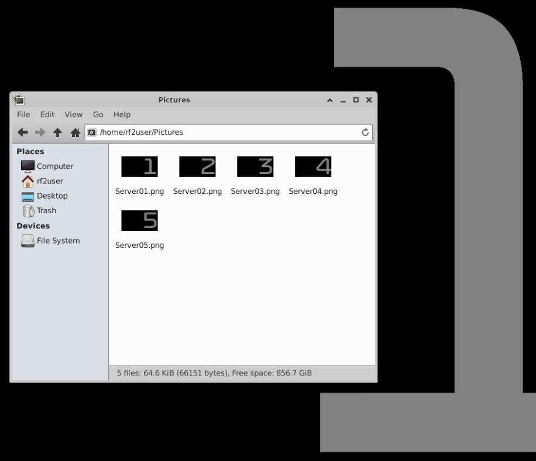

# rFactor2 Linux Server as Docker image

This is docker container that bootstraps a rFactor 2 container on an ubuntu.

## Hosting in docker ubuntu images

### Images structure

The server image is made of 4 docker files:
- Under **[src/00_build_blank_system](./src/00_build_blank_system)**
  - Linux system and packages
- Under **[src/01_build_blank_image](./src/01_build_blank_image)** 
  - Steamcmd install
  - RFactor 2 Log analyzer installation
- Under **[src/02_buildimage](./src/02_buildimage)**
  - Startup script
  - Mounted folder configuration in the image
- Under **[src/03_build_server_image](./src/03_build_server_image)**
  - Copies the admin scripts
  - Creates the desktop shortcuts
  - Copies wall papers
  - Download the rf2 server
    - Plus the cars and tracks
  - Also on that a folder, a bunch of pre built image build script for certain circuits and category.

Each image depends on the previous one.

### Testing the server image

- Under **[src/composes](./src/composes)** you will find a docker composes example
- You need to **add the ServerUnlock.bin file** to the mounted volume on the docker compose file otherwise, you won't be able to install DLCs.
  - *Do not commit your ServerUnlock.bin file* to a public repository otherwise your license will be used by other.
- **UserData** folder should be mounted to avoid complete reconfiguration of the server between restarts.

## Getting started - configuring the server

- On the **host**, 
  - **Upload ServerUnlock.bin** file to your home directory
- Connect to the server using a vnc client
- Run **./admin_start_server.sh**
  - This script attempts to start the server
  - On starting, it will creates the UserData folder structure and default file
- Run **./admin_patch_server_port.sh**
  - The scripts modifies Multiplayer.json to listen to the port defined in environment variables
- Run **./admin_show_desktop.sh** to load xfce4 as window manager
- **Disable the screensaver**
  - Go to *Applications > Settings > Screensaver*
  - Select disable
- On the **host**,
  - Copy **~/ServerUnlock.bin** to the the **UserData mounted folder**
- Install content from the image
  - Open xTerm
  - Run **./admin_start_modMgr.sh**
  - Select uninstalled package
  - Click Install
  - Click Update to update the components to the latest version
- Run **./admin_start_mas2.sh** 
  - create the package for your event
- Run **./admin_start_server.sh** to run the server

## In depth

### Port configuration

The port configuration defined in docker compose must the same as the those declared in the server - which lives in the container. 

When the server starts, it registers the port in the ladder. Use docker NAT to use different port won't work because rf2 server is not aware of the docker compose NAT configuration.

Example :

```yml
    ports:
      - 46100:5900
      - 65297:65297/tcp
      - 65298:65298/udp
      - 65299:65299/udp
      - 55297:55297/tcp
      - 55297:55297/udp
    environment:
      - VNC_PASSWORD=password
      - HTTP_SERVER_PORT=65297
      - SIMULATION_PORT=55297
```

- **Run ./admin_patch_serverPort.sh** script to match port defined in docker compose environment variable.

### Configure xfce4 for the first time

- **Run ./admin_show_desktop.sh** to launch xfce4
- **Disable screen saver**, go to Application > Settings > Screensaver
  - Otherwise, the screensaver activates and you won't be able to connect with VNC.

### Configure permission on mounted volums

- Ensure the docker container can write on the mounted folder
- root:root rwx rwx rwx
  - Otherwise, Userdata folder won't be usable by the server.

### Optional : set server wallpaper to identify the server

- Under **/home/rf2User/Pictures** 
  - you have a few wallpapers with numbers you can use to tag server background

- **Right click** on a picture > **Set as wall paper**

## Building the image

- Run any src/build_ script to initialize a server.

## Running an image

```Shell
docker run -p 5900:5900 rf2-linux-server-whatever
```

## Appendix

### Cleanup sh script from windows EOF char

When editing from windows or using GIT causes end of line to change from CRLF to LF. 

This makes the sh scripts fail. So there are two ways to solve this issue.

### Using a script

```Shell
sed 's/\r$//' input_file.txt > output_file.txt 
```

So this sed script remove them. You should use LF end of lines in your code editor.

### Configuring GIT

#### Disable auto CRLF on GIT

```Shell
git config --global core.autocrlf false
```

#### Eventually set default eof to LF

```Shell
git config --global core.eol lf
```

## Vehicle list

### GT3 list

```bash
gt3_bentley="1097230662"
gt3_c7r="1097232188"
gt3_mercedes="1097232656"
gt3_porsche911="1596822183"
gt3_mclaren_720s="1596821875"
gt3_bmwm6="1596822133"
gt3_audilms="1596822230"
gt3_astonmartin="1596822282"
gt3_ferrari488="2103827617"
gt3_bmwm4="2741380074"
```

### GTE list

```bash
cars="1411387394,1411394979,1411402133,1737056920,1411394979,2103827595,1411402194,2331284205,2331284105,2883380705"
```

# Thoughts

## "Why on earth did you use PowerShell ??"

I originally wrote some scripts to create and manage rF2 server instance. So I took the shortest road to have the server image working.

Second, I don't like bash. Its syntax is esoteric compared to powershell.

Third, this project is a hobby. Take a deep breath and run docker build ;).
